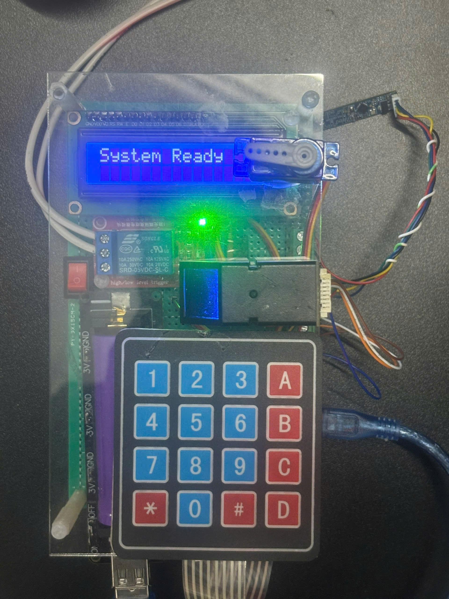
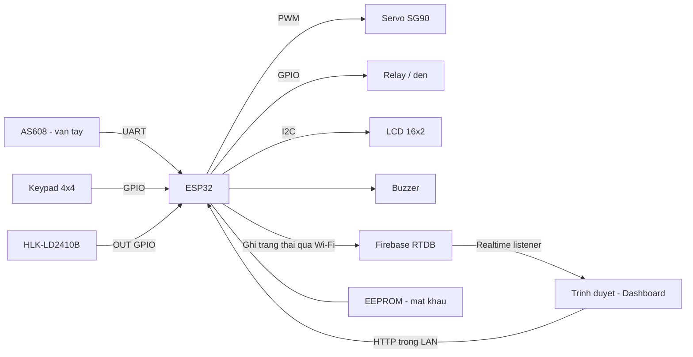
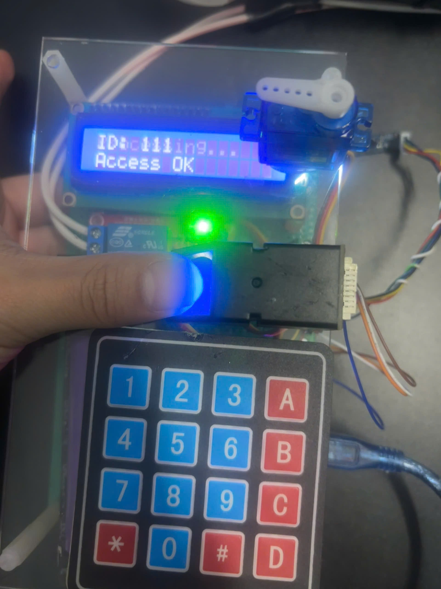
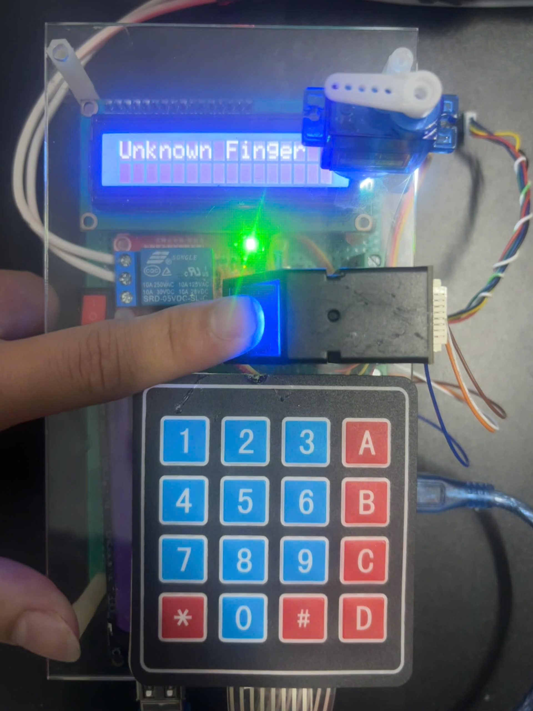
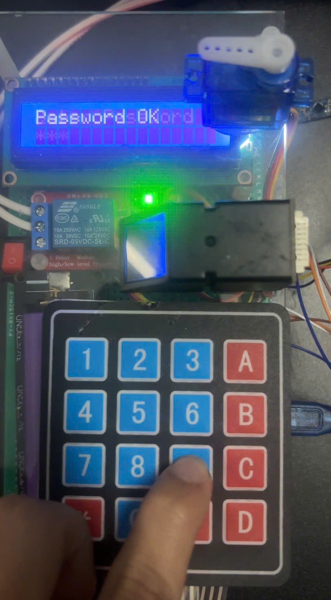

# ESP32 Smart Door Lock

**Mô hình khóa cửa điện tử xác thực bằng vân tay hoặc mật khẩu, mở rộng với Firebase và dashboard web.**

`ESP32` · `Arduino / C++` · `AS608` · `Keypad 4×4` · `Firebase RTDB` · `HTML / CSS / JavaScript`



> Đồ án môn học 1 — Ngành Công nghệ Kỹ thuật Máy tính, Khoa Điện – Điện tử, Trường Đại học Công nghệ Kỹ thuật TP. Hồ Chí Minh. Thực hiện: **Hà Quang Huy & Nguyễn Thành Đô**. Giảng viên hướng dẫn theo báo cáo: **ThS. Lê Minh**.

## Giới thiệu

Dự án xây dựng một mô hình kiểm soát ra vào sử dụng ESP32 làm bộ xử lý trung tâm. Người dùng mở cửa bằng vân tay đã đăng ký hoặc mật khẩu trên keypad; servo mô phỏng cơ cấu khóa. Cảm biến hiện diện hỗ trợ tự động bật đèn, LCD và buzzer phản hồi trạng thái thao tác.

Dự án gồm hai giai đoạn:

| Giai đoạn | Phạm vi | Tài liệu nguồn |
| --- | --- | --- |
| Khóa cửa cục bộ | Vân tay, mật khẩu, quản trị vân tay, servo, LCD và chiếu sáng | Báo cáo `DO_AN_1_final.docx` |
| Mở rộng IoT | Wi-Fi, web server trên ESP32, đồng bộ Firebase và dashboard | Mã nguồn từ `Smarthome.rar` |

Repository này chứa **mã nguồn phiên bản mở rộng IoT**, đã tách cấu hình cá nhân. Báo cáo gốc mô tả phiên bản cục bộ; ảnh thực nghiệm dưới đây thuộc phiên bản trong báo cáo.

## Chức năng

| Chức năng | Triển khai trong mã nguồn |
| --- | --- |
| Xác thực vân tay | AS608 so khớp mẫu đã lưu, LCD hiển thị ID khi hợp lệ |
| Mở cửa bằng mật khẩu | Keypad nhập mã; mật khẩu người dùng đọc từ EEPROM |
| Quản trị vân tay | Thêm/xóa mẫu theo ID 1–127, hướng dẫn trên LCD |
| Mô phỏng khóa cửa | SG90 quay 90°, chờ 3 giây, quay về 0° |
| Chiếu sáng tự động | Đọc chân OUT của radar, điều khiển relay |
| Dashboard web | Trang đăng nhập, trang trạng thái cửa/đèn và quản lý vân tay |
| Firebase RTDB | Gửi trạng thái cửa/đèn; dashboard đăng ký nhận thay đổi dữ liệu |

**Phạm vi điều khiển web:** trình duyệt gửi lệnh HTTP trực tiếp đến ESP32 trong mạng LAN. Firebase phục vụ đồng bộ trạng thái; mã hiện tại chưa có luồng nhận lệnh điều khiển qua Firebase từ Internet. Dashboard có giao diện Admin/Client nhưng cơ chế phân quyền backend chưa hoàn chỉnh.

## Kiến trúc



Cảm biến AS608 lưu mẫu vân tay trong bộ nhớ của cảm biến. Dữ liệu Firebase trong mã gồm trạng thái và metadata; không có chức năng tải ảnh/mẫu vân tay lên cloud.

## Hình ảnh thực nghiệm

| Vân tay được chấp nhận | Vân tay chưa đăng ký | Mật khẩu được chấp nhận |
| --- | --- | --- |
|  |  |  |

Ảnh trích từ Chương 4 của báo cáo. Báo cáo mô tả các chức năng cơ bản đã hoạt động ở mức mô hình thực nghiệm; chưa cung cấp thống kê tỷ lệ nhận diện, độ trễ hoặc kiểm thử dài hạn. Xem [kịch bản demo](docs/DEMO.md).

## Cấu trúc repository

```text
firmware/SmartDoorLock/
  SmartDoorLock.ino       # Wi-Fi, HTTP routes, Firebase, setup/loop
  hardware.cpp / .h       # GPIO, LCD, servo, relay, buzzer, keypad
  fingerprint.cpp / .h    # Xác thực và quản lý mẫu AS608
  password.cpp / .h       # Nhập mật khẩu, EEPROM, menu quản trị
  index.h                # Dashboard nhúng, được ESP32 phục vụ tại /
  config.example.h       # Mẫu cấu hình; không chứa token thật
docs/
  images/                # Ảnh thực nghiệm và sơ đồ từ báo cáo
  SETUP.md               # Cài đặt và cấu hình
  HARDWARE.md            # Linh kiện và bảng GPIO theo mã nguồn
  API.md                 # HTTP endpoints và schema Firebase
  REPORT_SUMMARY.md      # Tóm tắt báo cáo và đối chiếu phiên bản
  KNOWN_LIMITATIONS.md   # Các điểm còn cần hoàn thiện
  DEMO.md                # Kịch bản kiểm tra và quay video
  GITHUB_PUBLISH.md      # Hướng dẫn đưa repository lên GitHub
```

## Bắt đầu

1. Xem [bảng nối chân](docs/HARDWARE.md) trước khi cấp nguồn.
2. Mở `firmware/SmartDoorLock/SmartDoorLock.ino` bằng Arduino IDE và cài các thư viện trong [SETUP.md](docs/SETUP.md).
3. Sao chép `config.example.h` thành `config.local.h`, điền cấu hình riêng; sửa Firebase web config trong `index.h`.
4. Biên dịch, nạp ESP32, mở Serial Monitor ở 115200 baud và truy cập `http://<IP-ESP32>/` trong cùng mạng LAN.

Chưa xác nhận biên dịch hoặc chạy trên phần cứng cho bản đã chuẩn bị này. Archive không kèm phiên bản Arduino core/thư viện; cần kiểm chứng môi trường trước khi công bố một cấu hình build đã ổn định.

## Hạn chế và hướng phát triển

Đây là mô hình học tập. Các điểm cần hoàn thiện gồm xác thực HTTP phía ESP32, so khớp mật khẩu chính xác, đồng bộ trạng thái servo và loại bỏ các thao tác chặn vòng lặp. Xem [phân tích mã hiện tại](docs/KNOWN_LIMITATIONS.md).

Hướng phát triển: ghi nhật ký truy cập, giới hạn số lần xác thực sai, bổ sung timeout, quản lý tài khoản an toàn, thử nghiệm khi mất Wi-Fi và thiết kế PCB/cơ cấu khóa phù hợp.

## Tác giả và ghi nhận

- **Hà Quang Huy** — [GitHub cá nhân](https://github.com/haquanghuy1230-wq).
- **Nguyễn Thành Đô** — đồng thực hiện theo báo cáo.
- **ThS. Lê Minh** — giảng viên hướng dẫn của Đồ án môn học 1 theo báo cáo.

Tài liệu hiện có chưa xác định phần việc của từng thành viên, nên repository ghi nhận dự án nhóm. Chưa chọn giấy phép phân phối lại; các thư viện và tài nguyên bên thứ ba tuân theo giấy phép riêng.
