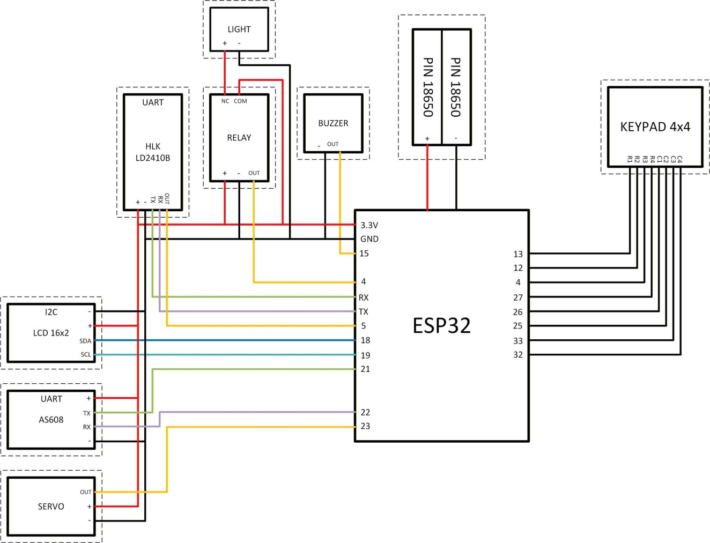

# Phần cứng và kết nối

| Thành phần | Vai trò | Số lượng trong mô hình |
| --- | --- | --- |
| ESP32 DevKit V1 | Xử lý và kết nối Wi-Fi | 1 |
| AS608 | Thu nhận, lưu và so khớp vân tay | 1 |
| Keypad 4×4 | Nhập mật khẩu / ID | 1 |
| HLK-LD2410B | Phát hiện hiện diện | 1 |
| LCD 16×2 + I2C | Hiển thị, địa chỉ trong mã 0x27 | 1 |
| SG90 | Mô phỏng khóa | 1 |
| Relay, đèn và buzzer | Chiếu sáng / âm báo | Theo mô hình |

## GPIO theo mã trong Smarthome.rar

| Thiết bị | Tín hiệu | GPIO ESP32 |
| --- | --- | --- |
| AS608 | RX ESP32 ← TX cảm biến | 21 |
| AS608 | TX ESP32 → RX cảm biến | 22 |
| LCD | SDA / SCL | 18 / 19 |
| Keypad | R1, R2, R3, R4 | 32, 33, 25, 26 |
| Keypad | C1, C2, C3, C4 | 27, 14, 12, 13 |
| Servo | PWM | 23 |
| Relay | Điều khiển HIGH bật, LOW tắt theo mã | 4 |
| Radar | OUT | 5 |
| Buzzer | Điều khiển | 2 |

AS608 dùng UART2, 57600 baud. Radar trong firmware này được đọc bằng chân OUT, không dùng UART; đây là điểm khác với một số phần mô tả trong báo cáo. Cần xác nhận thứ tự dây keypad và mức kích hoạt của module relay thực tế.

Sơ đồ trên thuộc bản báo cáo. Khi nạp firmware IoT, ưu tiên bảng GPIO được đối chiếu từ mã nguồn ở trên nếu có khác biệt.

Nguồn chính trong báo cáo là 5V; servo dùng nguồn phù hợp và nối chung GND. GPIO ESP32 là logic 3.3V: kiểm tra mức logic ngoại vi, đặc biệt pull-up của LCD I2C và module được cấp 5V, trước khi nối trực tiếp. GPIO 2, 5, 12 là các chân có liên quan cấu hình khởi động trên ESP32 cổ điển; kiểm tra nếu bo không boot khi đã nối ngoại vi. Bản mô hình nên kiểm tra relay bằng tải điện áp thấp.
